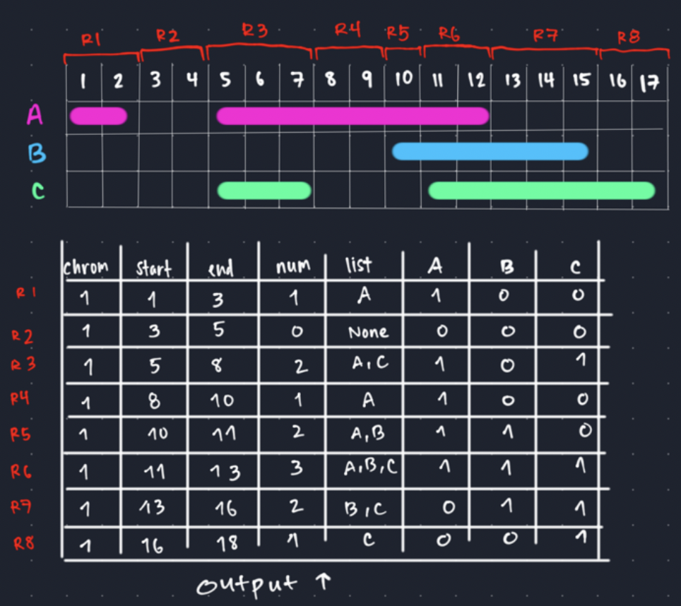

# Mask
Create a bed file containing a list of position will be marked as missing across all samples in the outputted SMC++ dataset. Without this, ROHan cannot distinguish between missing data and long ROH. 

## Mosdepth 
Used to create a set of "callable" regions 
https://github.com/brentp/mosdepth

```bash 
#!/bin/bash
#SBATCH --nodes=1
#SBATCH --mem=50GB
#SBATCH --time=48:00:00
#SBATCH --account=open
#SBATCH --partition=himem
#SBATCH --job-name=mosdepth
#SBATCH --output=/storage/group/zps5164/default/abc6435/KIWA_CONS/err_out/%x.%j.out
#SBATCH --error=/storage/group/zps5164/default/abc6435/KIWA_CONS/err_out/%x.%j.err

#Set Variables
scripts="/storage/home/abc6435/SzpiechLab/abc6435/KIWA_CONS/scripts"
mosdepth="/storage/home/abc6435/SzpiechLab/bin/mosdepth"
out="/storage/home/abc6435/SzpiechLab/abc6435/KIWA_CONS/data/mosdepth"
bam="/storage/home/abc6435/SzpiechLab/abc6435/KIWA_CONS/data/bam"

#Set Environmental Variables (controls output labels)
export MOSDEPTH_Q0=NO_COVERAGE   
export MOSDEPTH_Q1=LOW_COVERAGE 
export MOSDEPTH_Q2=CALLABLE 
export MOSDEPTH_Q3=HIGH_COVERAGE 

for i in `cat $scripts/btnw_ids.txt`; do
    $mosdepth \
        -n \
        --quantize 0:1:5:150:\
        $out/${i} \
        $bam/${i}.markdup.bam;
done
```

## Filter 
```bash
#!/bin/bash
#SBATCH --nodes=1
#SBATCH --mem=4GB
#SBATCH --time=48:00:00
#SBATCH --account=open
#SBATCH --partition=basic
#SBATCH --job-name=mosdepth_filter
#SBATCH --output=/storage/group/zps5164/default/abc6435/KIWA_CONS/err_out/%x.%j.out
#SBATCH --error=/storage/group/zps5164/default/abc6435/KIWA_CONS/err_out/%x.%j.err

#Set Variables
scripts="/storage/home/abc6435/SzpiechLab/abc6435/KIWA_CONS/scripts"
work="/storage/home/abc6435/SzpiechLab/abc6435/KIWA_CONS/data/mosdepth"

for i in `cat $scripts/btnw_ids.txt`; do
    zcat $work/${i}.quantized.bed.gz \
        | awk '($4=="LOW_COVERAGE" || $4=="NO_COVERAGE"){print $0}' \
        | cut -f1,2,3 \
        > $work/uncallable/${i}_mask.bed;
done
```
## Multi-Intersection
Using bedtools multiinter to find regions of uncallable sites shared across all samples. 


```bash
#Set Variables
scripts="/storage/home/abc6435/SzpiechLab/abc6435/KIWA_CONS/scripts"
work="/storage/home/abc6435/SzpiechLab/abc6435/KIWA_CONS/data/mosdepth/uncallable"

#Intesect uncallable regions and report regions with 3 or more samples
bedtools multiinter -header -i $work/*_mask.bed | awk '$4>= 3' | cut -f1,2,3 >> $work/mask.bed

#Change Chromosome Names
while read -r i j; do
    sed -i "s/${i}/${j}/g" $work/mask.bed;
done < $scripts/rename_chrs.txt

#Split by chromosome
for i in $(cat $scripts/autochrs.txt); do
    grep "${i}\b" $work/mask.bed > $work/${i}_mask.bed
    bgzip $work/${i}_mask.bed
    tabix -p bed $work/${i}_mask.bed.gz;
done